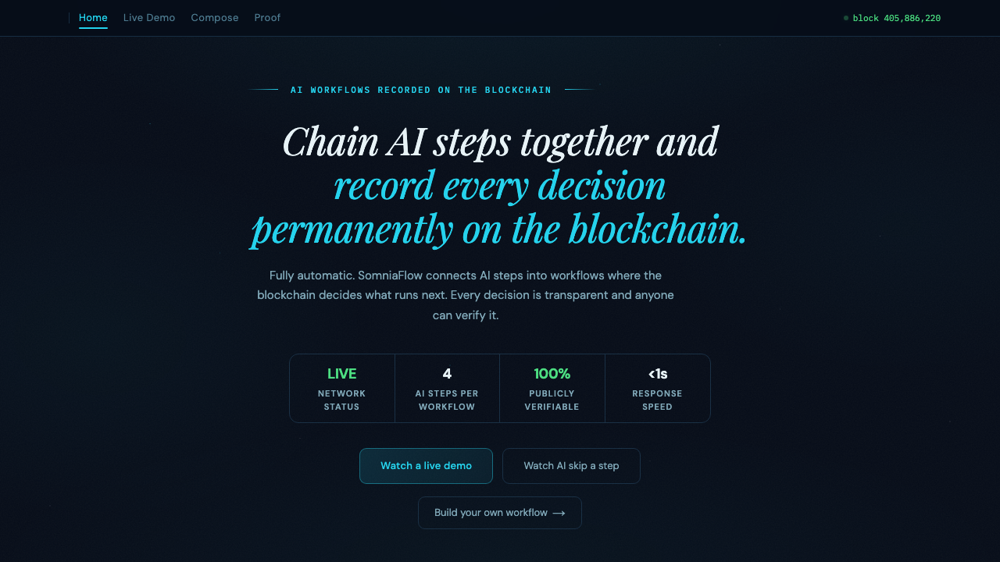

# SomniaFlow

[](https://www.typescriptlang.org/)
[](https://nextjs.org/)
[](https://soliditylang.org/)
[]()
[](LICENSE)

The first on-chain multi-agent orchestration protocol on Somnia. Register a pipeline once, trigger it once, and watch three agents coordinate autonomously. Every step is recorded on Shannon testnet through an on-chain FSM.



**Live demo:** [somniaflow.vercel.app](https://somniaflow.vercel.app)
**Contract:** [`0x1DEc4313A4d24Acb2DC9Bf3E03101176e88fCeBc`](https://shannon-explorer.somnia.network/address/0x1DEc4313A4d24Acb2DC9Bf3E03101176e88fCeBc) on Shannon testnet

---

## What It Does

Today, every multi-agent workflow on Somnia requires an off-chain coordinator. There is no on-chain mechanism for Agent A's output to automatically trigger Agent B in a trustless, auditable way. SomniaFlow fixes this.

The core is `PipelineRegistry.sol` — an on-chain FSM that stores pipeline definitions (ordered steps, agent assignments, balances) and emits `StepCompleted` events as each agent finishes. An off-chain relay coordinator listens to these events and dispatches the next step, giving you verifiable multi-agent coordination with every handoff recorded on-chain.

**Demo pipeline:**
1. **Data Fetcher** — fetches live data from a JSON API
2. **AI Analyst** — evaluates the data and decides: execute or skip the next step
3. **Conditional Actor** — runs only if the AI Analyst says execute; skipped otherwise

Every decision, step result, and branch path is stored as a transaction on Shannon testnet.

---

## Features

- **On-chain pipeline FSM**: `PipelineRegistry.sol` stores ordered steps, agent assignments, and balances; the contract is the source of truth
- **Conditional branching**: agents can mark steps as Skip, advancing past dependent steps without an off-chain controller deciding
- **Pipeline Composer**: build custom pipelines from the UI — choose agents, set conditional logic, deploy and fund on-chain from `/compose`
- **Live SSE stream**: the frontend streams step events in real time via Server-Sent Events, no WebSocket dependency
- **Demo mode**: pipelines run in-browser without STT via the simulate path, enabling review without testnet funds
- **Proof page**: live contract state and transaction hashes, queryable on Shannon Explorer
- **47 forge tests**: full coverage of registration, dispatch, fund management, and access control

---

## How to Verify On-Chain

1. Open the [Proof page](https://somniaflow.vercel.app/proof) — it fetches live state from the contract
2. Click any transaction hash to open [Shannon Explorer](https://shannon-explorer.somnia.network)
3. The `StepCompleted` events show every agent handoff in order

Or query directly:
```bash
cast call 0x1DEc4313A4d24Acb2DC9Bf3E03101176e88fCeBc \
  "getPipeline(uint256)(address,bool,uint8,uint256)" 1 \
  --rpc-url https://dream-rpc.somnia.network
```

---

## Architecture

```
User triggers pipeline
        │
        ▼
PipelineRegistry.sol ──► emits StepCompleted(pipelineId, stepIndex, result)
        │                          │
        │                          ▼
        │                 relay-coordinator.ts
        │                 (HTTP polling via ethers.js JsonRpcProvider)
        │                          │
        │                          ▼
        │                 dispatchNext(pipelineId)
        │                          │
        └──────────────────────────┘
                (loop until all steps done)
```

Every agent call, result, and branch decision is recorded as a transaction on Shannon testnet. No centralized coordinator controls the outcome — the contract is the source of truth.

---

## Tech Stack

| Layer | Choice |
|---|---|
| Smart contracts | Solidity 0.8.20 + Foundry |
| Chain | Somnia Shannon testnet (chain ID 50312) |
| Frontend | Next.js 14 App Router |
| Events | Native SSE (ReadableStream) |
| Blockchain client | ethers.js v6 (HTTP polling) |
| Relay | TypeScript relay coordinator listening to `StepCompleted` events |
| Styling | Tailwind CSS 3 |

---

## Running Locally

### Prerequisites

- Node.js 18+
- [Foundry](https://book.getfoundry.sh/getting-started/installation)
- A funded Shannon testnet wallet (get STT from the Somnia Discord faucet)

### 1. Install dependencies

```bash
npm install
forge install
```

### 2. Configure environment

```bash
cp .env.local.example .env.local
```

Fill in `.env.local`:
```env
DEPLOYER_PRIVATE_KEY=0x_your_private_key_here
DEPLOYER_ADDRESS=0x_your_address_here
NEXT_PUBLIC_REGISTRY_ADDRESS=0x1DEc4313A4d24Acb2DC9Bf3E03101176e88fCeBc
NEXT_PUBLIC_DEMO_PIPELINE_IDS=2,3
ANTHROPIC_API_KEY=sk-ant-your_key_here          # Required for AI Inference steps
API_KEY=                                         # Optional: set to lock mutating routes
```

### 3. Run the frontend

```bash
npm run dev
```

Open [http://localhost:3000](http://localhost:3000).

### 4. (Optional) Seed demo pipelines on-chain

Requires 4+ STT in your wallet to fund both demo pipelines:

```bash
npx ts-node scripts/seed-demo.ts
```

### 5. Run contract tests

```bash
forge test -v
```

47/47 tests pass. Coverage includes pipeline registration, step dispatch, fund management, and access control.

---

## Contract Interface

```solidity
// Register a new pipeline
function registerPipeline(
    address[] calldata agents,
    bytes32[] calldata stepData,
    string[] calldata names
) external returns (uint256 pipelineId);

// Fund a pipeline (STT for agent calls)
function fundPipeline(uint256 pipelineId) external payable;

// Trigger execution (starts step 0)
function triggerPipeline(uint256 pipelineId) external;

// Advance to next step (called by relay after StepCompleted event)
function dispatchNext(uint256 pipelineId) external;
```

---

## Deployed Contract

| Network | Address | Explorer |
|---|---|---|
| Shannon testnet | `0x1DEc4313A4d24Acb2DC9Bf3E03101176e88fCeBc` | [View](https://shannon-explorer.somnia.network/address/0x1DEc4313A4d24Acb2DC9Bf3E03101176e88fCeBc) |

**Shannon testnet:** Chain ID 50312 | RPC `https://dream-rpc.somnia.network` | Explorer `shannon-explorer.somnia.network`

---

## Project Structure

```
somniaflow/
├── contracts/
│   ├── PipelineRegistry.sol   # On-chain FSM contract
│   └── ChainTest.sol          # Chain connectivity test
├── src/
│   └── app/
│       ├── page.tsx            # Home — pipeline cards + stat strip
│       ├── pipeline/[id]/      # Pipeline detail + SSE stream UI
│       ├── compose/            # Pipeline Composer — build custom pipelines on-chain
│       ├── proof/              # Live on-chain proof page
│       └── api/pipeline/       # Backend routes (register, fund, trigger, state, stream, reset)
├── scripts/
│   └── seed-demo.ts            # Seeds funded demo pipelines on Shannon
├── test/                       # Forge test suite (47 tests)
└── submission/
    └── proof.md                # On-chain TX hashes for submission
```

---

Built for the [Somnia Agentathon](https://somnia.network) (Encode Club × Somnia).

## License

MIT
