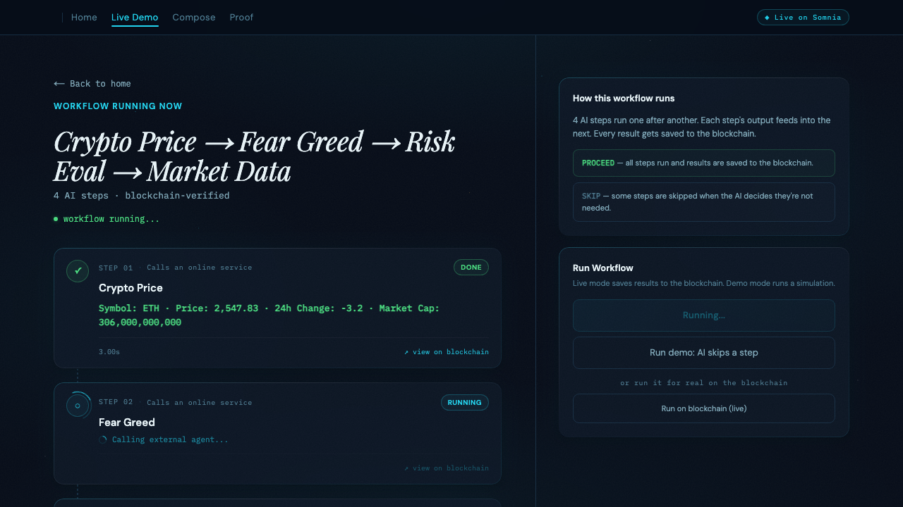
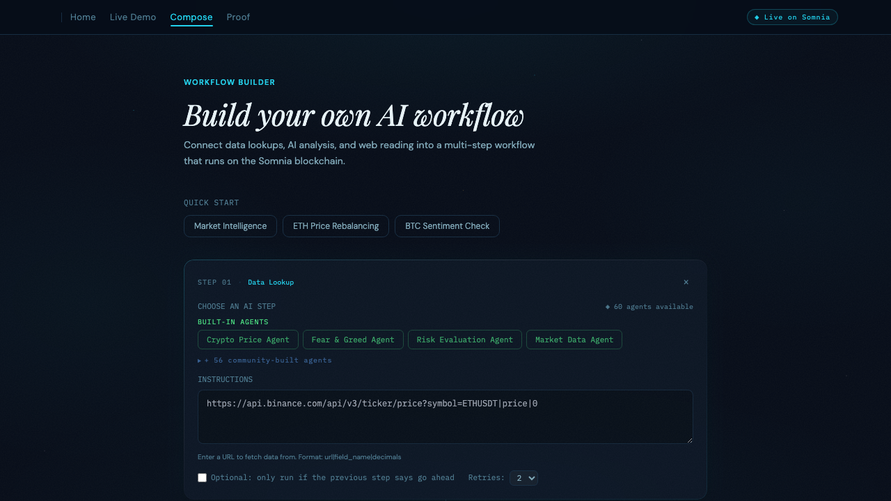
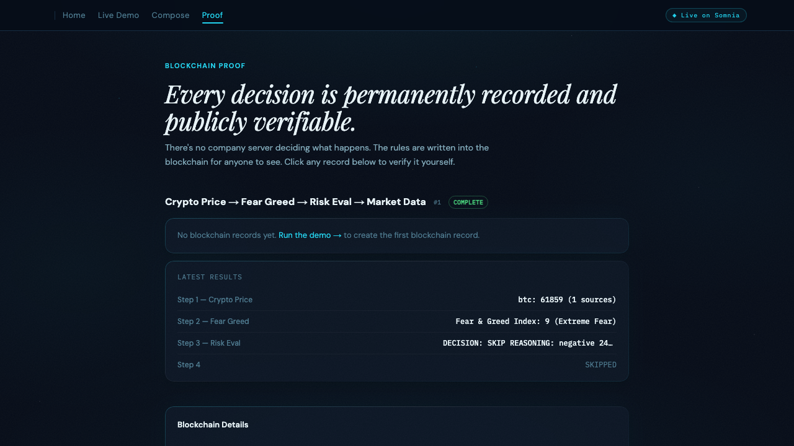

# SomniaFlow: On-Chain Multi-Agent Orchestration Protocol

Register a pipeline of AI agents on-chain, trigger it once, and the blockchain coordinates everything. Every step, every decision, every branch path is a transaction on Somnia Shannon testnet. No off-chain controller decides the outcome.

[](https://www.typescriptlang.org/)
[](https://nextjs.org/)
[](https://soliditylang.org/)
[]()
[](LICENSE)

**Live:** [somniaflow.vercel.app](https://somniaflow.vercel.app)

---


## Live Demo

**[somniaflow.vercel.app](https://somniaflow.vercel.app)**

Click "Watch a live demo" to see a 4-agent pipeline execute end-to-end with live blockchain verification. Click "Watch AI skip a step" to see conditional branching in action.

---

## What Is SomniaFlow?

Multi-agent AI workflows today run on centralized servers. One company decides what agent runs next, which steps get skipped, and what results get stored. None of it is auditable.

SomniaFlow moves the coordination layer on-chain. A Solidity smart contract (`PipelineRegistry.sol`) acts as a finite state machine: it stores pipeline definitions, advances steps, evaluates branch conditions, and records every result as a transaction. The contract is the source of truth, not a server.

---

## Screenshots

| Landing Page | Pipeline Execution |
|---|---|
|  |  |

| Workflow Composer | Blockchain Proof |
|---|---|
|  |  |

---

## Features

- **On-chain pipeline FSM**: `PipelineRegistry.sol` stores ordered steps, agent assignments, and balances. The contract is the source of truth
- **Conditional branching**: the Risk Evaluator agent outputs EXECUTE or SKIP, and `_containsExecute()` (pure Solidity) gates downstream steps on-chain
- **Pipeline Composer**: build custom pipelines from the UI at `/compose`. Choose agents, set conditional logic, deploy and fund on-chain
- **4 agent types**: JSON API, LLM Inference, LLM Parse Website, External. Each has a different dispatch and response path
- **Live SSE streaming**: the frontend streams step events in real time via Server-Sent Events
- **Demo mode**: pipelines run in-browser without STT via the simulate path, so anyone can review without testnet funds
- **Proof page**: live contract state and transaction hashes, queryable on Shannon Explorer
- **47 Foundry tests**: full coverage of registration, dispatch, fund management, conditional branching, and access control

---

## How It Works

```
User triggers pipeline via UI
        |
        v
PipelineRegistry.sol (on-chain FSM)
        |
        +---> registerPipeline()   stores step definitions on-chain
        +---> triggerPipeline()    starts step 0, emits StepCompleted
        +---> handleResponse()     records result, evaluates branch condition
        +---> _containsExecute()   pure Solidity gate: EXECUTE or SKIP
        +---> dispatchNext()       advances to next step
        |
        v
relay-coordinator.ts (off-chain relay)
        |
        +---> Listens for StepCompleted events via HTTP polling
        +---> Calls dispatchNext() to advance the FSM
        +---> Cannot change the branch outcome (read-only relay)
        |
        v
Next.js Frontend (SSE stream)
        |
        +---> Real-time step updates via Server-Sent Events
        +---> Proof page links every TX to Shannon Explorer
```

### Demo Pipeline (4 Agents)

| Step | Agent | Type | Role |
|------|-------|------|------|
| 1 | Crypto Price | JSON API | Fetches live BTC price from CoinGecko, Binance, CoinPaprika (multi-source average) |
| 2 | Fear & Greed | JSON API | Fetches market sentiment index from alternative.me |
| 3 | Risk Evaluator | LLM Inference | 4-component risk scorer (sentiment, price stability, timing, volatility). Outputs EXECUTE or SKIP |
| 4 | Market Data | JSON API | Fetches top movers by market cap. Only runs if Risk Evaluator outputs EXECUTE |

Both branches are proven on-chain: Pipeline 1 hit SKIP (step 4 blocked), Pipeline 2 hit EXECUTE (all 4 steps ran).

---

## Tech Stack

| Layer | Technology |
|-------|-----------|
| Smart contracts | Solidity 0.8.20 + Foundry |
| Chain | Somnia Shannon testnet (chain ID 50312) |
| Frontend | Next.js 14 App Router |
| Events | Native SSE (ReadableStream) |
| Blockchain client | ethers.js v6 (HTTP polling) |
| Relay | TypeScript relay coordinator |
| AI | Anthropic Claude API (LLM Inference steps) |
| Styling | CSS custom properties (dark observatory theme) |

---

## Testing

```bash
forge test -v
# Result: 47/47 passing
```

Tests cover pipeline registration, step dispatch, fund management, conditional branching (`_containsExecute`), access control, and edge cases (empty steps, unknown pipeline IDs, double triggers).

---

## Try It (2 minutes)

1. Go to [somniaflow.vercel.app](https://somniaflow.vercel.app)
2. Click "Watch a live demo" to see the EXECUTE branch (all 4 agents run)
3. Click "Watch AI skip a step" to see the SKIP branch (step 4 blocked by the contract)
4. Open the [Proof page](https://somniaflow.vercel.app/proof) and click any TX hash to verify on Shannon Explorer
5. Try the [Pipeline Composer](https://somniaflow.vercel.app/compose) to build a custom workflow

---

## Contract Interface

```solidity
struct PipelineStepInput {
    uint8 agentType;        // 0=JSON_API, 1=LLM_INFERENCE, 2=LLM_PARSE_WEBSITE, 3=EXTERNAL
    string inputTemplate;   // Template with {prevResult} placeholder
    bool conditionalOnPrev; // If true, step may be skipped based on prior output
    uint8 maxRetries;
}

// Register a new pipeline (returns pipeline ID)
function registerPipeline(PipelineStepInput[] calldata steps)
    external payable returns (uint256 pipelineId);

// Fund a pipeline (STT for agent calls)
function fundPipeline(uint256 pipelineId) external payable;

// Trigger execution (starts step 0)
function triggerPipeline(uint256 pipelineId) external;

// Called by relay after each StepCompleted event
function ownerHandleResponse(uint256 pipelineId, uint256 stepIndex, string calldata result)
    external;
```

---

## On-Chain Verification

| What | Address / Link |
|------|----------------|
| PipelineRegistry | [`0x7B19a2a65bC9604A40cc27F03C21A5329A7793e1`](https://shannon-explorer.somnia.network/address/0x7B19a2a65bC9604A40cc27F03C21A5329A7793e1) |
| Shannon Platform | [`0x037Bb9C718F3f7fe5eCBDB0b600D607b52706776`](https://shannon-explorer.somnia.network/address/0x037Bb9C718F3f7fe5eCBDB0b600D607b52706776) |
| Chain ID | 50312 |
| RPC | `https://dream-rpc.somnia.network` |
| Explorer | [shannon-explorer.somnia.network](https://shannon-explorer.somnia.network) |

Verify yourself:
```bash
cast call 0x7B19a2a65bC9604A40cc27F03C21A5329A7793e1 \
  "getPipeline(uint256)(address,bool,uint8,uint256)" 1 \
  --rpc-url https://dream-rpc.somnia.network
```

---

## Running Locally

### Prerequisites

- Node.js 18+
- [Foundry](https://book.getfoundry.sh/getting-started/installation)
- A funded Shannon testnet wallet (get STT from the Somnia Discord faucet)

### Install and run

```bash
git clone https://github.com/dmustapha/somniaflow.git
cd somniaflow
npm install
forge install
cp .env.example .env.local
# Fill in your private key, wallet address, and Anthropic API key
npm run dev
```

Open [http://localhost:3000](http://localhost:3000).

### Seed demo pipelines on-chain

Requires 4+ STT in your wallet:

```bash
npx ts-node scripts/seed-demo.ts
```

### Required Environment Variables

| Variable | Description |
|----------|-------------|
| `DEPLOYER_PRIVATE_KEY` | Shannon testnet wallet private key |
| `DEPLOYER_ADDRESS` | Wallet address matching the private key |
| `NEXT_PUBLIC_REGISTRY_ADDRESS` | PipelineRegistry contract address |
| `NEXT_PUBLIC_DEMO_PIPELINE_IDS` | Comma-separated pipeline IDs for the demo |
| `ANTHROPIC_API_KEY` | Required for LLM Inference agent steps |
| `API_KEY` | Optional: locks mutating API routes |

---

## Project Structure

```
somniaflow/
├── contracts/
│   └── PipelineRegistry.sol    # On-chain FSM contract (667 lines)
├── src/
│   ├── app/
│   │   ├── page.tsx             # Home: pipeline cards, stat strip, hero
│   │   ├── pipeline/[id]/       # Pipeline detail + SSE stream UI
│   │   ├── compose/             # Pipeline Composer: build custom workflows
│   │   ├── proof/               # On-chain proof page with TX hashes
│   │   └── api/
│   │       ├── agent/           # 4 agent endpoints (crypto-price, fear-greed, risk-eval, market-data)
│   │       └── pipeline/        # Backend routes (register, fund, trigger, state, stream, reset, simulate)
│   ├── lib/
│   │   ├── relay-coordinator.ts # Off-chain relay: listens for StepCompleted, calls dispatchNext
│   │   ├── relay-executor.ts    # Per-agent-type execution logic
│   │   ├── pipeline-service.ts  # On-chain reads via ethers.js
│   │   └── event-bus.ts         # Global SSE event bus for real-time updates
│   └── components/              # LiveBlock, SiteNav, StepCard
├── scripts/
│   └── seed-demo.ts             # Seeds funded demo pipelines on Shannon
├── test/                        # Foundry test suite (47 tests)
└── submission/
    └── proof.md                 # On-chain TX hashes for hackathon submission
```

---

Somnia Shannon testnet: Chain ID 50312 | RPC `https://dream-rpc.somnia.network` | Explorer `shannon-explorer.somnia.network`

Built for the [Somnia Agentathon](https://www.encode.club/somnia-agentathon) (Encode Club x Somnia).

## License

MIT
